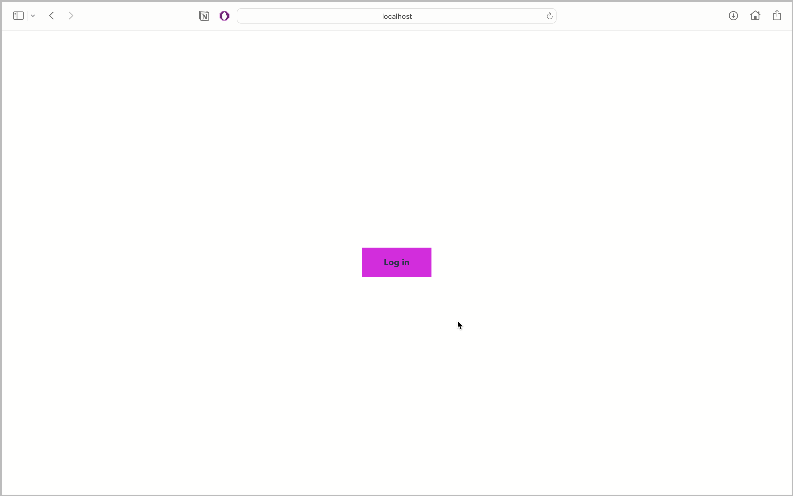
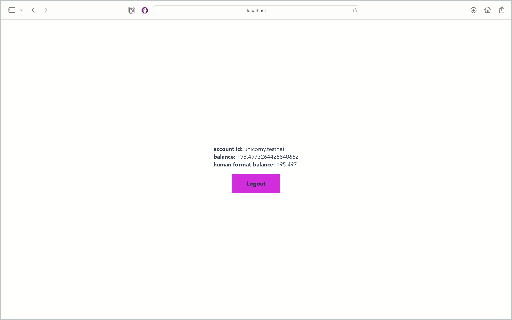

## example of the vue app with near-api-js connection

---

Code itself is quite self-describable, so there are no comments. Almost. The most important thing is to use Buffer.Buffer as window.Buffer (in `./near/index.ts:5`): in some cases app does not work without it.

Basically, this repository can be used as template for your project: It has essential (_imo_) packages - eslint + prettier with reasonable configs, husky with pre-commit git hook to format code before commit

### screenshots

